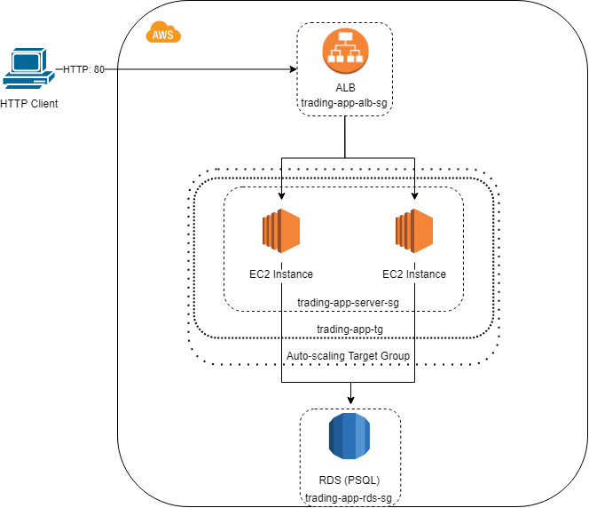
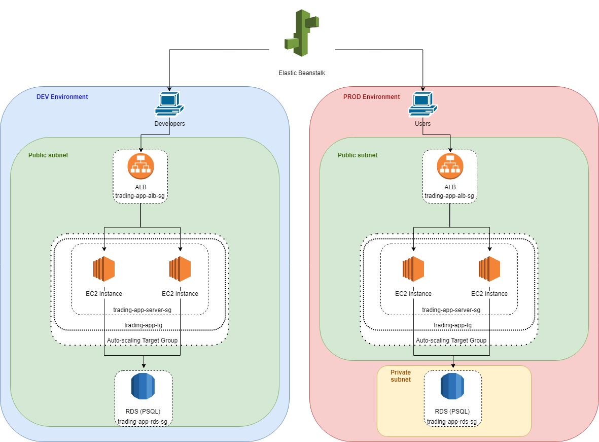
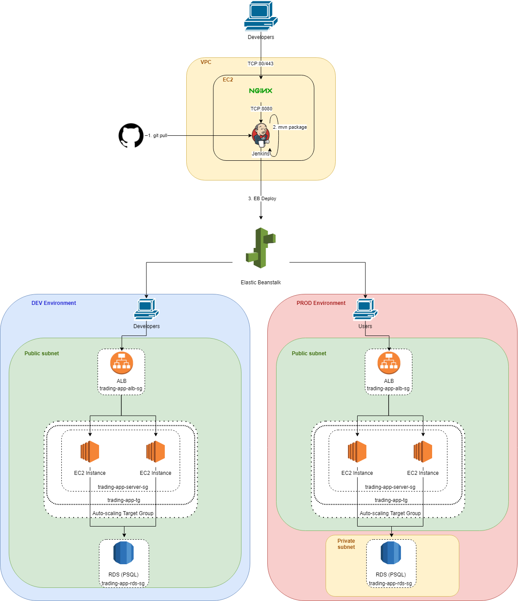

# Introduction
In this project, we deploy a SpringBoot application to AWS to takes advantage of its auto-scaling and automated deployment features. Since our project follows a three-tiered microservice pattern, the application tier is a good candidate for AWS's Application Load Balancer (ALB). This would enable AWS to deploy EC2 instances as needed for our application. We use Elastic Beanstalk to define the environment for our application, as well as configuring the load balancer. In order to streamline updates to the production environment, we used Jenkins to create a CI/CD pipeline that automatically pulls new versions of the application from GitHub, builds, and deploys them.

# Application Cloud Architecture
  
An environment configuration for our application was created in Elastic Beanstalk, including an Application Load Balancer and Auto Scaling group. The load balancer will take incoming HTTP requests and map them to a target group, keeping the workload even across instances. The Auto Scaling group handles the creation and removal of EC2 instances according to the demands of incoming traffic. The ALB also performs health checks on the instances to avoid directing requests to a dead instance. This combination of tools makes our application both scalable and elastic.

# Deployment Environments

Elastic Beanstalk allows us to create multiple environments for our application. These environments exist independently of each other and can serve different functions. In our case, we created two similar environments - one for development and one for production. This separation is to prevent untested code from ending up in front of the user.

# Jenkins Server

# Jenkins CI/CD pipeline
Setting up a CI/CD pipeline requires another EC2 instance running separately from from the EB environments. This instance is configured as a NGINX reverse proxy which redirects port 80 traffic to Jenkins on port 8080. Build instructions are laid out in the Jenkinsfile, which tells Jenkins how to handle builds from each branch. When the process starts, Jenkins pulls the new application versions from the GitHub repository and its branches. It uses Maven's package command to build a jar, which is then deployed by Elastic Beanstalk to the appropriate environment.

# Improvements
- Find a way for Jenkins to automatically detect new commits to each branch
- Set up additional environments for different feature branches
- Reconfigure scaling triggers to avoid using excess resources
