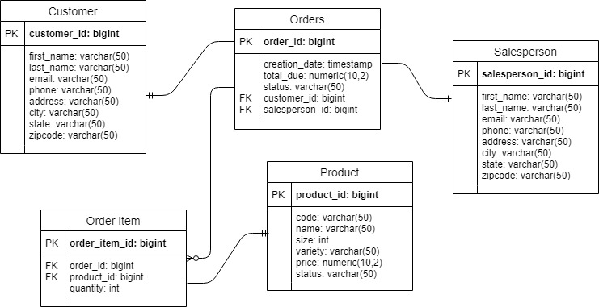

# JDBC  
## Introduction  
This program implements a simple interface to execute queries and read results on a given database. The program does this by implementing simple Data Access Objects that encapsulates the query results. In particular, the implemented DAO's aalso have methods to perform and organize certain SELECT queries (i.e. find by ID).  
  
From this project, I learned more about the abstract concepts of DAO's, DTO's and the purpose they serve in separating the application from the database. I was also re-familiarized with the use of JDBC API.  

## ER Diagram

## Design Patterns
The DAO is a design pattern that allows developers to isolate application logic from the database itself. The intent of this is to allow the application and the database to be changed separately without impacting each other. The end result is that the View layer is not dependent on the DAO layer and only the Services layer will depend on it. This pattern can also support data access in multiple tables, and provide encapsulation of more complex join and aggregation queries. A developer implementing this pattern should be on the lookout for leaky abstraction.  

The Repository pattern is also intended to separate the application from the database. However, the implementation of Repository focuses only on accessing a single table for each class. A DAO that only accesses one table would be very similar to a Repository. Another difference is that Repositories perform joins within their own methods, rather than performing them in the database proper. In general, a Repository pattern is more suitable for horizontally scalable applications due to its focus on single-table access. A DAO pattern may be more suitable for a vertically scalable application.
