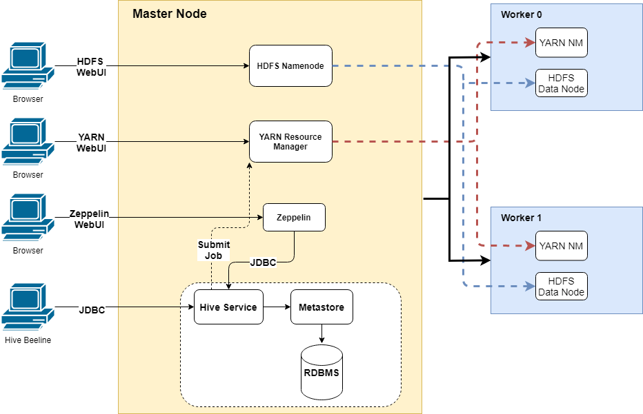
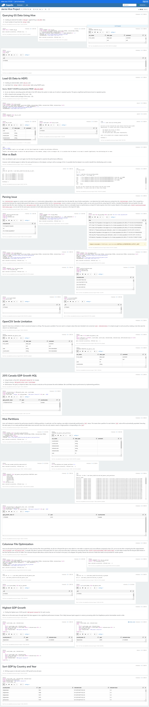

# Table of contents
* [Introduction](#Introduction)
* [Hadoop Cluster](#hadoop-cluster)
* [Hive Project](#hive-project)
* [Improvements](#improvements)

# Introduction
The purpose of this project is to help the data analytics team process data using Apache Hadoop and evaluate different data analytics tools. This project utilized Google Storage to stage the dataset, before copying it into a Hadoop cluster. The cluster itself is set up on Google Cloud Platform (GCP) as a master and two workers. Data processing is carried out using Apache Hive to execute queries on the nodes.

Through this project we explored Hadoop's core components including: MapReduce, HDFS, and YARN.

# Hadoop Cluster
  

### HDFS
The Hadoop Distributed File System is a distributed file system designed to be run on commodity hardware and to have high fault-tolerance. It is well suited for applications with large datasets because of the throughput access it provides to application data. 

### MapReduce
MapReduce is a software design framework for writing applications that process large volumes of data. Its main characteristics are in-parallel processing across many nodes and high fault-tolerance.

### YARN
YARN is the component responsible for managing resources and scheduling jobs in the Hadoop framework. YARN maintains a ResourceManager that is the highest authority in directing resources to all applications in the system. Within each machine, YARN maintains a NodeManager and an ApplicationMaster. The NodeManager monitors containers and their resource usage, reporting this data back to the ResourceManager. The ApplicationMaster is responsible for negotiating resources from the ResourceManager and working with the NodeManager to execute tasks.

### Hive
Apache Hive is a data warehouse software that provides SQL functionality to distributed file systems. It is capable of executing queries via MapReduce and handling a variety of file types through its Serializer Deserializer.

### Zeppelin
Apache Zeppelin is a browser-based notebook that we use in this project to organize, execute and view the results of our Hive queries. Its language interpreters also allow us to interact with the HDFS via bash.

# Hive Project

 
# Improvements
- Experiment with adding and removing worker nodes and its impact on performance
- Conduct similar experiments with larger datasets and more file types
- Test more complex queries
