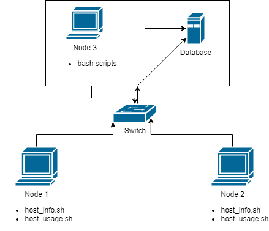

# Linux Cluster Monitoring Agent
## Introduction
The Linux Cluster Administration team has requested a solution to record the hardware specifications and resource usage of their cluster nodes. The cluster being served consists of 10 nodes, all running CentOS 7 and internally connected by a switch. Communication is carried out over internal IPv4 addresses.

The data will be collected realtime from each node and be stored in an RDBMS. This data will be compiled into reports, which in turn will be used to inform future resource planning (e.g. increasing or decreasing the size of the cluster).

The solution presented is merely a minimum viable product (MVP), and has been tested on a single machine rather than a cluster. However, with the correct setup, the solution should perform just as well in a cluster environment. The solution also contains some sample queries to answer hypothetical business questions.

## Architecture and Design

### Database Tables
`host_info` - This table contains each node's hardware specifications. For the sake of practicality, only the most relevant specifications are recorded. This includes CPU model and clock speed, total memory, and the timestamp of when this information was captured.  
`id` - Serial ID of host machine in the database, auto-incremented  
`hostname` - Name of host sysem  
`cpu_number` - CPU core count of host system  
`cpu_architecture` - Architecture of host CPU  
`cpu_model` - Model name of host CPU  
`cpu_mhz` - Core clock speed of host CPU (in MHz)  
`L2_cache` - L2 cache size of host machine (in KB)  
`total_mem` - Total usable memory of host machine (in KB)  
`timestamp` - Timestamp of captured specifications  

`host usage` - This table contains each node's resource usage at time of capture. As before, only the most relevant information is recorded. This includes CPU, memory, and disk usage.  
`host_id` - Serial ID relating to host machine in `host_info`  
`memory_free` - Total free memory at time of capture (KB)  
`cpu_idle` - Percentage of CPU load idling  
`cpu_kernel` - Percentage of CPU load operating on kernel  
`disk_io` - Ongoing I/O operations in disk  
`disk_available` - Amount of available disk space (in MB)  

### Scripts
`psql_docker.sh` - This script contains some basic functionality to manage the PostgreSQL instance. It can be used to create new instances, and start/stop existing ones.

`host_info.sh` - This script is responsible for capturing a node's hardware specifications, constructing the relevant INSERT query, and executing it. This script will generally only be run once, or whenever a node's specs are changed.

`host_usage.sh` - This script captures a node's resource usage at any given point in time. It will construct and execute the INSERT query for the data. This script is meant to be run automatically, at set time intervals for an accurate picture of a node's usage.

## Usage
### Initialisation
`./psql_docker.sh [create/start/stop] [db_username] [db_password]`  
The database instance runs within a Docker container. The psql_docker script can create a new container with the corresponding parameters or start an existing one.

`ddl.sql`  
This file contains the queries that create the database tables. The queries can be executed within the PostgreSQL client with `\i`, or the `-f` option on launch.

`./host_info.sh [host address] [port] [db_name] [db_username] [db_password]`  
To be run on each node initially, and then whenever hardware is updated.

`./host_usage.sh [host address] [port] [db_name] [db_username] [db_password]`  
To be run at regular time intervals. See: Using crontab.

`queries.sql`
This file contains a couple sample queries. That can be used on the database. The first query will group hosts by in descending order of their total memory capacity. The second query will display average host memory usage over five minute intervals.

Using crontab  
To run scripts automatically with crontab, enter edit with with `crontab -e`.  
`* * * * * bash/.../host_usage.sh [args] > /tmp/host_usage.log`
The above example will run host_usage.sh at the start of every minute, and log the result of the most recent operation. Use `crontab -l` to verify the job is running.

## Improvements 
- Detect hardware failure while scripts are running
- Expand database to track other resource metrics
- Create a single script to streamline the usage process
