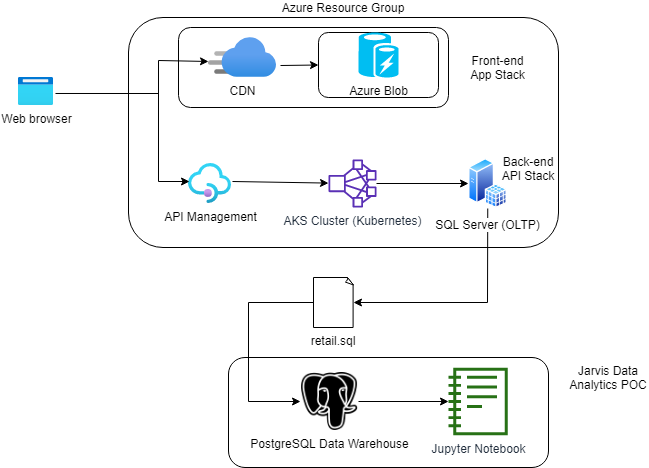

# Introduction
London Gift Shop (LGS) is a UK-based online retailer with an emphasis on giftware. They have been operating for many years but their growth has recently stagnated. Therefore, they are interested in taking advantage of newer data technologies to develop new sales and marketing strategies. Their own departments lack the resources to spare for this kind of project, they have agreed to work with  Jarvis to solve the issue.

The work presented here is a proof-of-concept to demonstrate to the LGS marketing team that we are capable of answering their business questions. As such, the Jarvis team was not allowed to work directly in the LGS Azure environment. Instead, their IT team provided us with transaction data from 01/12/2009 and 09/12/2011 to work with. To store the data, we used a PostgreSQL container to which we could easily connect a Jupyter Notebook. For analysis, we utilized a Python data manipulation library called Pandas and matplotlib for visualization.

# Project Architecture

The LGS IT team did reveal their application architecture for the project. The LGS store runs on the Azure Cloud as a Resource Group. The front-end is handled by a content delivery network which retrieves resources from blob storage as needed. The back-end is handled by Azure's API Management service, which in turn routes requests to a scalabe Azure Kubernetes cluster. There is also an SQL Server running to perform OLTP. From this server, the LGS team has provided us a ```retail.sql``` file to perform our analytics on. On our side, the data is stored in a PostgreSQL instance and interpreted through a Jupyter notebook.

# Data Analytics and Wrangling
[[Notebook](https://github.com/jarviscanada/jarvis_data_eng_danny/blob/develop/python_data_analytics/retail_data_analytics_wrangling.ipynb)]
From the data provided we can visualize trends in their sales throughout the year. As a giftware retailer, this may show LGS which holidays could be capitalized on. We are also able to perform an RFM segmentation, categorizing customers based on the recency, frequency, and historical value of their purchases. This information can be used to shape future marketing campaigns. For example: customers that have purchased recently, often, and spend a lot are categorized as "Champions". Champions are highly valuable customers that should be enticed to stay with a rewards program. Offering them new products and engaging them for reviews are great ways to keep them coming back and helping to promote your brand.

# Improvements
- Request more data to analyze the following:
- Find out which types of gift items are often purchased by new customers
- Investigate what causes customers to cancel orders
- Research more strategies to increase customer retention
