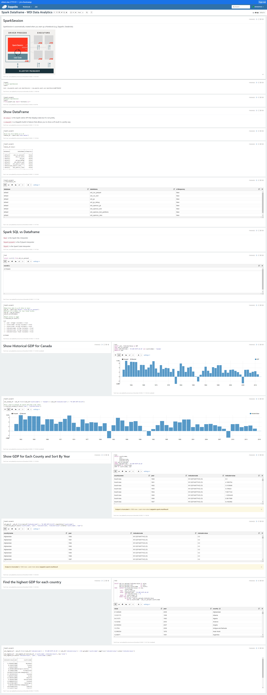

# Spark/Scala Project
# Introduction
London Gift Shop (LGS) had previously approached our team to perform some data analytics on their existing sales data. Our first project together had been to use Jupyter notebook on some sample data in order to prove that we ware capable of using the data to answer business questions. Since the notebook project proved effective, LGS is interested in expanding the project to the rest of the company.

However, our previous solution is not properly scalable to our new needs, since it only runs on a single computer. To amend that, we will be exploring a new solution that supports parallelization. In the end we decided to use Azure Databricks, an Apache Spark service provided by Microsoft. To interact with our Spark cluster we used the PySpark interpreter in Databricks notebooks.

# Zeppelin and Spark Implementation

To start, we evaluated Spark on a sample World Development Index dataset from the year 2016. The cluster and storage was set up on Google Cloud Platform, arranged as 1 master node and 2 workers. The nodes were loaded with images that were preconfigured for Hadoop and Spark. Once the cluster was ready, we uploaded the dataset into the Hadoop Distributed File System and created an external Hive table from it. We used PySpark to load this table into a Dataframe which we performed our analytics on. Our analytics mostly consisted of finding historical GDP data on all listed countries.

# Databricks and Spark Implementation
  
[[Notebook](https://github.com/jarviscanada/jarvis_data_eng_danny/blob/develop/spark/notebook/data_analytics_pyspark.ipynb)]
Our team selected Azure Databricks to carry on the project. The dataset provided by LGS consisted of transaction data between 01/12/2009 and 09/12/2011. The data came in the form of CSV and was uploaded to Azure DBFS, a distributed file system available to our cluster, and read it into our cluster as a Dataframe. The Dataframe spanned all the workers in the cluster which allowed us to leverage more computational power for our work. Our analytical work focused on finding trends in their transactions over the given time frame and categorizing customers based on the recency and frequency of their visits. This information could be used to inform marketing campaigns towards certain customer segments, such as offering rewards programs to long-time customers.

# Future Improvements
- Obtain larger data set so we can test performance limits
- Work with business analysts to find meaningful segmentations for customers
- Analyze what items attract the most first-time customers
