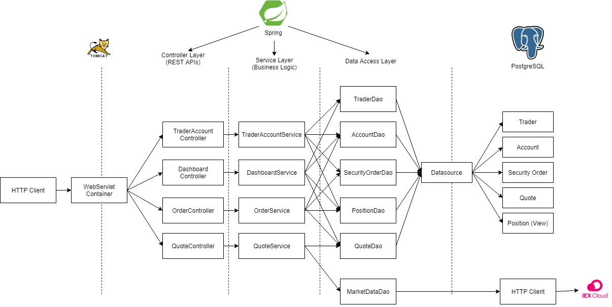
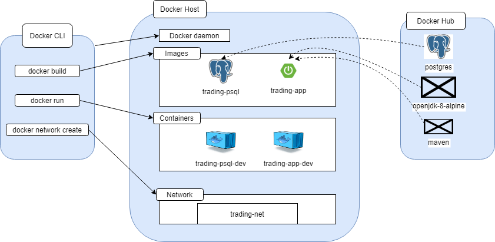

Table of contents
* [Introduction](#introduction)
* [Quick Start](#quick-start)
* [Architecture](#architecture)
* [Docker Deployment](#docker-deployment)
* [Improvements](#improvements)


 # Introduction  
This project is a mockup of an online trading platform. The idea was to create a scalable application using microservice architecture and Springboot framework.  
  
The application uses the IEX Cloud REST API to obtain ticker information including latest market prices. Once that information is obtained, the application stores it in a Postgresql database. The Postgresql database also maintains records of traders, their accounts, and orders on the platform. When an order is executed, the app handles the appropriate operations on the accounts.  
  
# <a name="#quick-start" />Quick Start
- Pre-requisites: Docker, CentOS 7, IEX Cloud access  
  
- ```/psql/Dockerfile```
	This Dockerfile builds the trading-psql image, which is based off the  Postgresql image and initializes two databases (one for use and one for testing) using the .sql files in ```/psql/sql_ddl/```.  
- ```/Dockerfile```  
	This Dockerfile builds the trading-app image, which is based on the ```openjdk:8-alpine``` and the ```maven:3.6-jdk-8-slim``` images. The container compiles and packages the source code using ```maven``` and will then execute the jar file.  
  

## Build and Run Instructions
```  
docker build -t trading-psql ./psql  
docker build -t trading-app .
  
docker network create --driver bridge trading-net  
  
docker run --name trading-psql-dev \
-e POSTGRES_PASSWORD=password \
-e POSTGRES_DB=jrvstrading \
-e POSTGRES_USER=postgres \
--network trading-net \
-d -p 5432:5432 trading-psql

IEX_PUB_TOKEN="your_token_here"

docker run --name trading-app-dev \
-e "PSQL_URL=jdbc:postgresql://trading-psql-dev:5432/jrvstrading" \
-e "PSQL_USER=postgres" \
-e "PSQL_PASSWORD=password" \
-e "IEX_PUB_TOKEN=${IEX_PUB_TOKEN}" \
--network trading-net \
-p 5000:5000 -t trading-app  
```  

# Architecture  
  
### Controller Layer  
  The Controller layer is responsible for handling the user input and forming the appropriate HTTP requests. It then calls the Service layer to return the results.
  
### Service Layer
  The Service layer validates the contents of each request, and will accordingly throw exceptions if there is an issue. This layer also handles the business logic of executing requests. When an operation is performed, such as a buying or selling order, the Service layer ensures that it can be done without breaking database consistency.  
  
### DAO Layer
  The DAO layer retrieves data and handles other queries to external data sources. All SQL queries are constructed and executed through the DAO layer, and results are returned through it. Paths for HTTP requests to the IEX cloud are similarly dealt with here.
  
### SpringBoot
  SpringBoot provides the essential feature of dependency injection, which allows for loose-coupling between the application components. This makes the individual project components easier to test, maintain, and expand on.

### PSQL and IEX
  PostgreSQL provides the RDBMS we use to persist user and market data. IEX Cloud provides a REST API that we used to obtain the latest market data.

# REST API Usage
## Swagger  
  Swagger is a powerful yet easy-to-use suite of API developer tools for teams and individuals, enabling development across the entire API lifecycle, from design and documentation, to test and deployment. Our purpose for using Swagger is that it provides automatically generated and interactive API documentation. This is useful to developers that are maintaining or expanding the app.  
  
## Quote Controller  
  This controller makes HTTP requests to the IEX Cloud to retrieve market data. It calls to the Quote service which in turn executes the requests through the Market Data DAO. When a result is returned, it is converted from its JSON form into a POJO that is persisted in the database.  
  ### Endpoints  
  - GET ```/quote/dailyList```: Show all the currently saved tickers in the database.  
  - GET ```/quote/iex/ticker/{ticker}```: Returns information of the specified ticker.
  - PUT ```/quote/```: Update the specified quote using given DTO.
  - PUT ```/quote/iexMarketData```: Update the specified quote using data from IEX Cloud.
  - POST ```/quote/tickerId/{tickerId}```: Add a new ticker to the Quote table.  
  
## Trader Account Controller
  This controller handles the creation of trading accounts and operations related to them, including the depositing and withdrawal of funds. It communicates with the Trader Account service to receive results.  
   ### Endpoints  
  - PUT ```/trader/deposit/traderId/{traderId}/amount/{amount}```: Deposit a fund into a trader account.
  - PUT ```/trader/withdraw/traderId/{traderId}/amount/{amount}```: Withdraw a fund from a trader account.
  - POST ```/trader/```: Create a trader account using DTO.
  - POST ```/trader/firstname/{firstname}/lastname/{lastname}/dob/{dob}/country/{country}/email/{email}```: Create a trader account using request path.
  - DELETE ```/trader/traderId/{traderId}```: Delete a trader from the database.
  
## Order Controller  
  This controller posts market orders to the database. It relies on the Order service to ensure the correct business logic.   
  ### Endpoints
  - POST ```/order/marketOrder```: Posts a market order using an order DTO.
  
## Dashboard controller  
  This controller retrieves views of traders and their portfolio data from the database. It calls on the Dashboard service to validate user input and obtain results.  
  ### Endpoints
  - GET ```/dashboard/portfolio/traderId/{traderId}```: Obtain data on a trader's positions by their ID.  
  - GET ```/dashboard/profile/traderId/{traderId}```: Obtain data on a trader and associated account funds by their ID.  
  
# Docker Deployment  
  
  - ### Docker Hub and Images  
  The Docker Hub is the official repository of Docker images used by many developers. In this project we pull Postgres and JDK images from the Hub as bases for our app. For the Postgres image, we extend it in a Dockerfile to build ```trading-psql``` with instructions to copy DDL files from our project. These are automatically executed when the image is built to initialize a pre-defined database schema for our use. The OpenJDK and Maven images are extended with instructions to build, package, and execute the ```trading-app```.
  The Docker network ```trading-net``` creates an isolated environment for the containers to communicate in. This ensures that outside services don't accidentally communicate with our containers and vice versa.

# Improvements
- Integration with a GUI would greatly enhance usability.  
- Script to automatically retrieve updated market data from IEX Cloud.  
- Use JDBC transactions when executing market orders.
- Secure login for users.
- Extend business logic to cover different order types.
